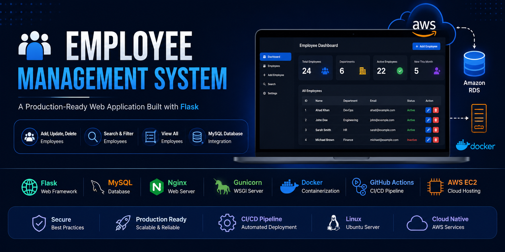

<p align="center">
  
</p>
<p align="center">


</p>
# 🚀 Employee Management System

A production-ready **Employee Management System** developed using **Flask** and **MySQL**, designed to demonstrate modern backend development and cloud deployment practices.

The application is containerized with **Docker**, served using **Gunicorn** behind **Nginx**, and deployed on an **AWS EC2** instance with **Amazon RDS** as the database. Automated testing and deployment are handled through **GitHub Actions**, showcasing a complete CI/CD workflow.

This project demonstrates practical experience with cloud infrastructure, Linux server administration, containerization, and deployment automation.

---

## 📌 Features

- ➕ Add Employee
- ✏️ Update Employee
- ❌ Delete Employee
- 🔍 Search Employee
- 📋 View All Employees
- 🗄️ MySQL Database Integration
- 🐳 Docker Containerization
- ⚙️ Docker Compose Support
- 🌐 Production Deployment using Nginx + Gunicorn
- ☁️ AWS EC2 + Amazon RDS
- 🚀 GitHub Actions CI Pipeline

---

# 🛠️ Tech Stack

| Category | Technology |
|----------|------------|
| Backend | Flask (Python) |
| Database | MySQL (Amazon RDS) |
| Web Server | Nginx |
| WSGI Server | Gunicorn |
| Containerization | Docker |
| Multi-Container | Docker Compose |
| Cloud | AWS EC2 |
| Version Control | Git & GitHub |
| CI | GitHub Actions |
| OS | Ubuntu Linux |

---

# 📂 Project Structure

```text
employee-management-system/
│
├── app.py
├── requirements.txt
├── Dockerfile
├── docker-compose.yml
├── README.md
│
├── templates/
│
├── static/
│
└── .github/
    └── workflows/
        ├── ci.yml
        └── deploy.yml
```

---

# 🏗️ Architecture

# 🏗️ AWS Architecture

<p align="center">
  
</p>

### Deployment Flow

1. Developer pushes code to GitHub.
2. GitHub Actions starts the CI pipeline.
3. Docker image is built.
4. The application is deployed to an AWS EC2 instance.
5. Nginx forwards requests to Gunicorn.
6. Gunicorn serves the Flask application.
7. The Flask application communicates with Amazon RDS (MySQL).
---

# 🚀 Deployment Architecture

```text
Developer
     │
git push
     │
     ▼
GitHub
     │
     ▼
GitHub Actions
     │
     ▼
CI Pipeline
     │
     ▼
Docker Build
     │
     ▼
EC2 Deployment
     │
     ▼
Docker Compose
     │
     ▼
Nginx
     │
     ▼
Gunicorn
     │
     ▼
Flask
     │
     ▼
Amazon RDS
```

---

# ⚙️ Installation

## Clone Repository

```bash
git clone https://github.com/ahadkhan4718-bit/employee-management-system.git

cd employee-management-system
```

---

## Create Virtual Environment

```bash
python3 -m venv venv

source venv/bin/activate
```

---

## Install Dependencies

```bash
pip install -r requirements.txt
```

---

## Run Application

```bash
python app.py
```

---

# 🐳 Docker

## Build Image

```bash
docker build -t employee-app:v1 .
```

## Run Container

```bash
docker run -d -p 8001:8000 --name employee employee-app:v1
```

---

# 🐳 Docker Compose

Start Application

```bash
docker compose up -d
```

Rebuild Application

```bash
docker compose up -d --build
```

Stop Application

```bash
docker compose down
```

---

# ☁️ AWS Deployment

The application is deployed using:

- Amazon EC2
- Amazon RDS
- Nginx
- Gunicorn
- Docker
- Docker Compose

---

# 🔄 CI Pipeline

GitHub Actions automatically performs:

- Checkout Repository
- Setup Python
- Install Dependencies
- Python Syntax Check
- Build Docker Image

---

# 📸 Screenshots

Add screenshots here.

Example:

```
screenshots/
├── home.png
├── add-employee.png
├── search.png
└── docker.png
```

---

# 📚 What I Learned

Through this project I learned:

- Linux Commands
- Git & GitHub
- Flask Development
- MySQL Database
- Amazon EC2
- Amazon RDS
- Docker
- Docker Compose
- Gunicorn
- Nginx
- Systemd
- GitHub Actions (CI)
- Production Deployment
- Troubleshooting Production Servers

---

# 🔮 Future Improvements

- Continuous Deployment (CD)
- Terraform
- CloudWatch Monitoring
- Elastic IP
- Load Balancer
- Auto Scaling
- HTTPS using SSL
- Domain Name Integration

---

# 👨‍💻 Author

**Ahad Khan**

GitHub:
https://github.com/ahadkhan4718-bit

LinkedIn:
https://linkedin.com/in/ahad-khan-ak

---

⭐ If you found this project useful, consider giving it a Star.
